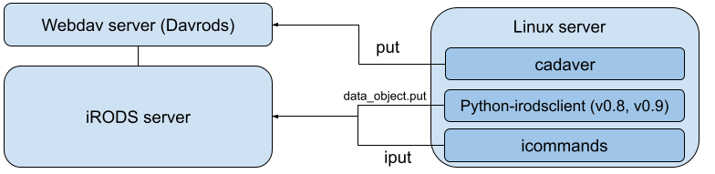

# irodsperf

This project provides an automated framework for benchmarking data‑ingestion performance into iRODS using three different clients: **iCommands**, **python‑irodsclient**, and **WebDAV**. The goal is to measure how efficiently each protocol handles both large files and large numbers of small files under identical conditions.



The figure above describes the server setup for the performance tests with the webdav protocol and the native iRODS client `icommands`.

## Installation and configuration

To run the benchmarking framework, three clients must be configured correctly: **iCommands**, **python‑irodsclient**, and **WebDAV (`cadaver`)**. All clients must authenticate to the same iRODS account and operate inside the same home collection.

### 1. iCommands Configuration

The framework reads connection details from your standard iRODS environment file:

```
~/.irods/irods_environment.json
```

This file **must** include two additional fields:

- `irods_home` – your iRODS home collection  
- `irods_password` – used by python‑irodsclient for non‑interactive authentication  

These settings are used by **both** iCommands and python‑irodsclient.


### 2. python‑irodsclient

Install:

```bash
pip install python-irodsclient
```

The framework creates sessions using:

- all SSL and connection settings from `irods_environment.json`
- the password stored in the same file

You will need an `irods_environment.json` as described above.


### 3. WebDAV (`cadaver`)

The WebDAV endpoint must point to the **project root**, not your iRODS home.  

Create a `~/.cadaverrc` file:

```
open https://irodswebdavendpoint/homepath/
username USER
password USER_PW
```

This allows the framework to run `cadaver` non‑interactively.

### Verify:

```bash
cadaver https://irodswebdavendpoint/homepath
dav:/homepath/> ls
```

## iRODS Data and local data

All clients operate on the same iRODS collection:

```
perfTest
```

The framework:

- creates it if needed  
- empties it before each upload batch  
- removes it after each client completes its tests  

The local temporary data files are created according input parameters and are removed automatically
No manual cleanup is required.

## Usage (Python)

The benchmarking framework is designed to be run directly from Python.
The main entry point is:

```python
run_all_tests(
    clients,
    large_sizes,
    num_small,
    small_size,
    output_file,
    datafolder,
)
```

This function:

- validates all clients
- prepares the `perfTest` collection
- generates test data (large + small files)
- runs all upload benchmarks
- records timing results
- writes them to a pickle file


### Basic example

```python
from irodsperf.orchestrator import run_all_tests

run_all_tests(
    ["python"],          # clients to test
    large_sizes=[1, 2],  # large file sizes in GB
    num_small=10,        # number of small files
    small_size=64,       # size of each small file in KB
    output_file="test.pkl",
    datafolder="test",
)
```

This runs:

- python‑irodsclient tests only
- one large file of 1 GB
- ten small files of 64 KB
- results saved to `test.pkl`
- temporary test data stored in `test/`

### Running multiple clients

```python
run_all_tests(
    ["python", "icommands", "webdav"],
    large_sizes=[1, 5],
    num_small=4000,
    small_size=512,
    output_file="results.pkl",
    datafolder="data",
)
```

This will benchmark:

- python‑irodsclient
- iCommands
- WebDAV (`cadaver`)

using:

- 1 GB and 5 GB large files
- 4000 small files of 512 KB


### Output

`run_all_tests()` writes the results it to disk:

```python
results = run_all_tests(...)

import pickle
pkl_file = open("test.pkl",'rb')
results = pickle.load(pkl_file)
```

The pickle file contains:

- per‑client timings
- per‑file timings
- checksum vs non‑checksum modes
- summary statistics

Plot the results with `plots.py`.

### Cleanup

All temporary collections (`perfTest`) and temporary data files are removed automatically after each run.

## Usage (CLI)

```
pip install .

irodsperf
usage: irodsperf [-h] [--all] [--clients CLIENTS [CLIENTS ...]]
                 [--sizes SIZES [SIZES ...]] [--small-files SMALL_FILES]
                 [--small-size SMALL_SIZE] [--output OUTPUT] [--plot PICKLE]
                 [--plot-out PLOT_OUT]

iRODS performance benchmarking tool

options:
  -h, --help            show this help message and exit
  --all                 Run the full benchmark with the selected parameters (default:
                        False)
  --clients CLIENTS [CLIENTS ...]
                        Clients to benchmark (default: ['python', 'icommands',
                        'cadaver'])
  --sizes SIZES [SIZES ...]
                        Large file sizes in GB (default: [2, 3, 5])
  --small-files SMALL_FILES
                        Number of small files to generate (default: 4000)
  --small-size SMALL_SIZE
                        Size of each small file in KB (default: 500)
  --output OUTPUT       Output pickle file (default: irodsPerformances.out.pickle)
  --plot PICKLE         Plot results from a pickle file instead of running benchmarks
                        (default: None)
  --plot-out PLOT_OUT   Filename for saving the plot (default: plot.png)
```

Example

```
irodsperf --clients python --sizes 1 --output out.pkl

Running with parameters:

{   'clients': ['python'],
    'output_file': 'out.pkl',
    'sizes': [1],
    'small_files': 4000,
    'small_size': 500}

irodsperf --plot out.pkl
```
